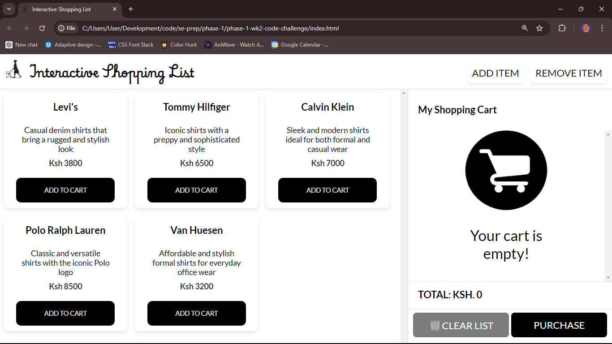

# Interactive Shopping List

This is a website containing a manual shopping list where users can add items to the cart and purchase the items. Users can also add a new item and delete an existing card. An item has three properties: name, description and price.

Items added to the cart can be deleted individually or the entire list can be cleared. The
items added on the cart are calculated by the price and displayed as total.

The whole website depends on HTML, CSS and Javascript using document-object-modelling to manipulate the visible items on the webpage.

